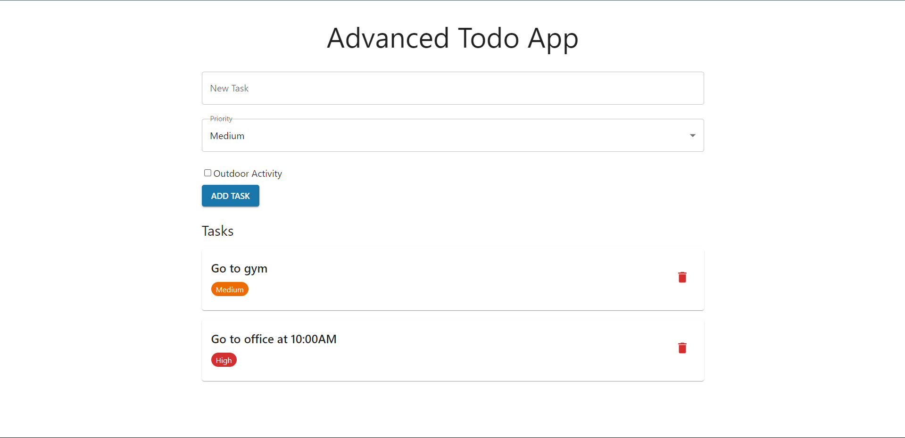
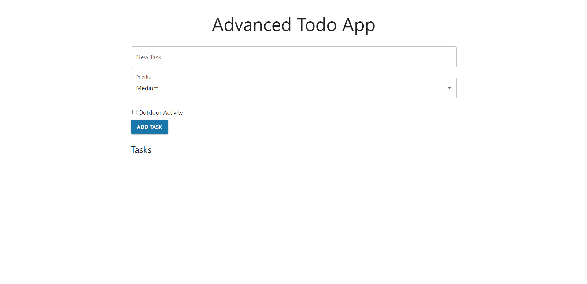

# 🚀 Advanced Todo App  

  

## 📌 Overview  
The **Advanced Todo App** is a modern, feature-rich task management application built using **React** and **Material-UI**. It allows users to add, update, delete, and organize tasks efficiently.  

## 🌟 Features  
✅ Add, Edit, and Delete Tasks <br> 
✅ Mark as completed or pending <br>
✅ Beautiful UI with Material-UI  
✅ Responsive Design  
✅ Local Storage Support  

## 🛠️ Tech Stack  
- **Frontend:** React.js, Material-UI  
- **State Management:** useState, useEffect  
- **Backend (Optional):** Node.js, Express, MongoDB  

## 📸 Screenshots  
| Output| 
|------------|
|  |
|------------|
||

## 🚀 Installation & Setup  
```sh
git clone https://github.com/Adarshjeet0/advanced-todo-app.git
cd advanced-todo-app
npm install
npm start
```

## Login Credentials
- **Username:** user  
- **Password:** password  

**_Fill **user** in username and **password** in password field_**
